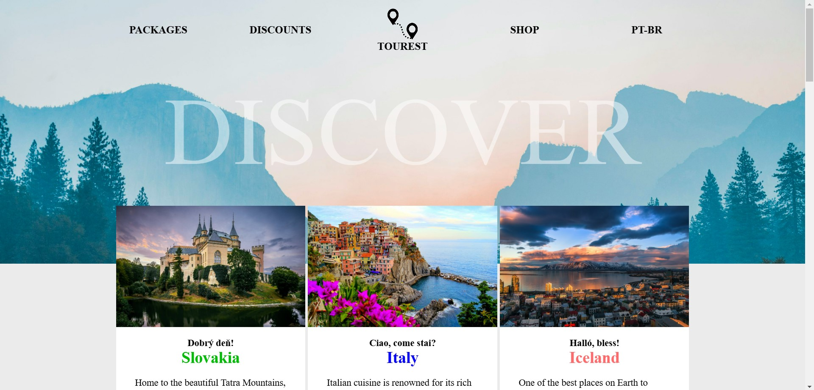

<h2 align="center">Deploy link:</h2>

@[Tourest](https://alef-basilio.github.io/E-commerce---FrontEnd---04-2024/)

```
https://alef-basilio.github.io/E-commerce---FrontEnd---04-2024/
```


<h1 align="center" style="color: #805ad5; font-weight: bold;">Tourest</h1>
<p align="center">
Topics: 
<a href="#tech">Technolgies</a> |
<a href="#how">How was made</a> |
<a href="#obj">Objective</a>
</p>


<p align="center">
<b>An application that captures the user's attention with the possibilities for rest on the trips offered.</b>
</p>


<p align="center">
  <p align="center">
    
  </p>
</p>


<h2 id="tech" align="center">Technologies</h2>
JavaScript, HTML and CSS.


<h2 id="how" align="center">How was made</h2>
I implemented multiple components in each section, such as translation, adaptive layout, among others, so that the user has an engaging interaction with the elements.
</br>
I used many CSS features (hover, media, etc.) while maintaining visual cohesion in order to overcome the limits I learned from the courses with this markup language.
</br>
The varying responses of the components were a challenge for responsiveness, however, it was successfully achieved thanks to creative solutions such as the existence of two dynamic menus.


<h2 id="obj" align="center">Objective</h2>
Evolve my page styling limits.
